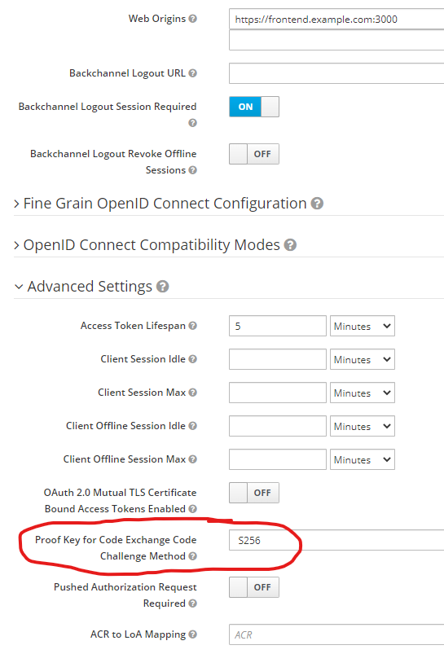
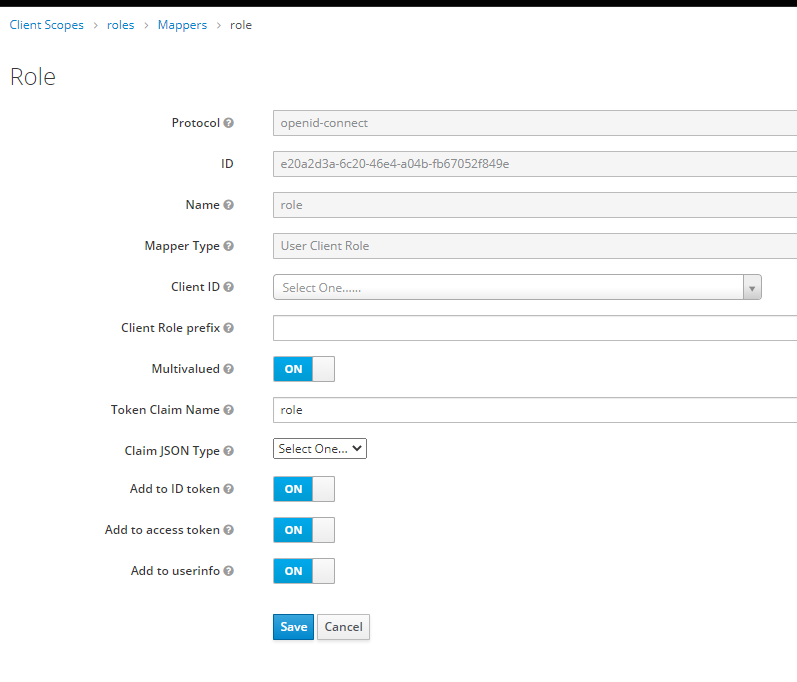

# react-webapi-oidc
Prototype of a React SPA frontend with WebAPI backend using Keycloak open source OIDC provider.

This example demonstrates authentication and authorization of a *React* single page application (SPA) frontend,
backed by a *C#, .NET, WebAPI* backend, to the *Keycloak* identity provider, using 
*Authorization Code Flow with Proof Key for Code Exchange (PKCE)*.

## Parts of the system
The system consists of three separate parts, each running on its own domain. In this sample, the domains 
are configured as follows:

- https://keycloak.example.com/ -- Keycloak identity provider
- https://frontend.example.com:3000/ -- React frontend application
- https://backend.example.com:7094/ -- WebAPI backend application

If you are running all three on your development machine, you can add the following entries 
to the **hosts** file:
```
127.0.0.1       keycloak.example.com
127.0.0.1       backend.example.com
127.0.0.1       frontend.example.com
```
Please note *https* is essential for authentication. For development purposes, if you want to run 
this sample locally then configure and trust self-signed TLS certificates. 

## Keycloak configuration

Most of the Keycloak default configuration settings work well with this setup, with two notable exceptions.

### Enable Proof Key for Code Exchange (PKCE)
First of all, in the client advanced settings, please set 
the *Proof Key for Code Exchange Code Challenge Method* to **S256**.



This may also be good time to verify that your *Access Token Lifespan* is set to 
a relatively short value, something like 5 minutes usually works well.

### ASP.NET Role Based Authentication
For *Role Based Authentication* to work, ASP.NET expects the user roles to be listed in 
the **role** claim (singular, without “s” at the end). As such you can add role mapper to 
the `Client Scopes` – `roles` - `Mappers`:

